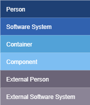
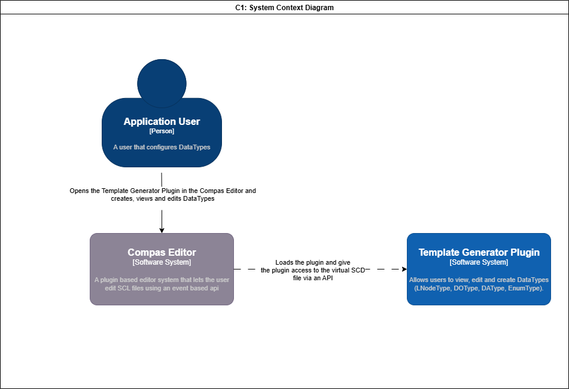
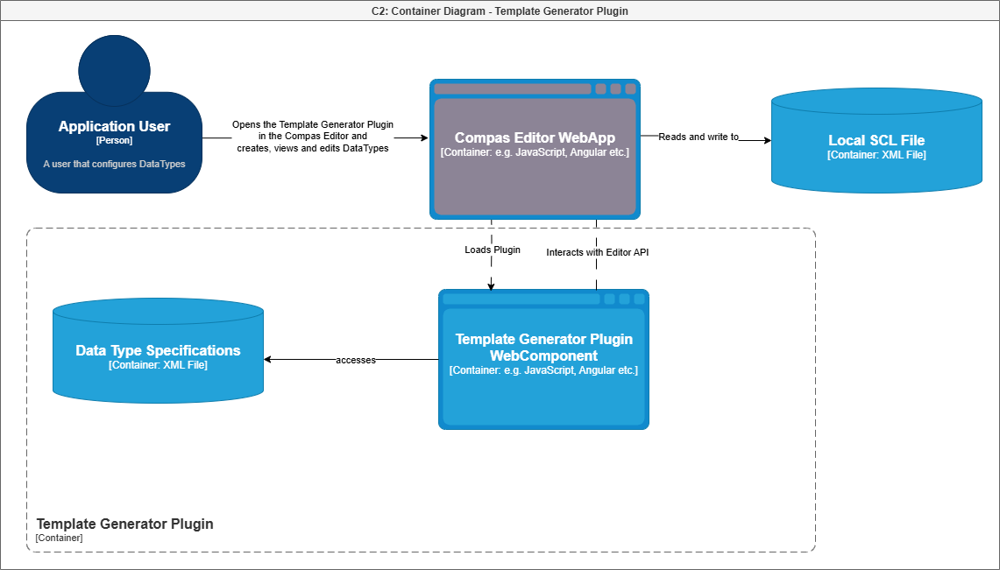
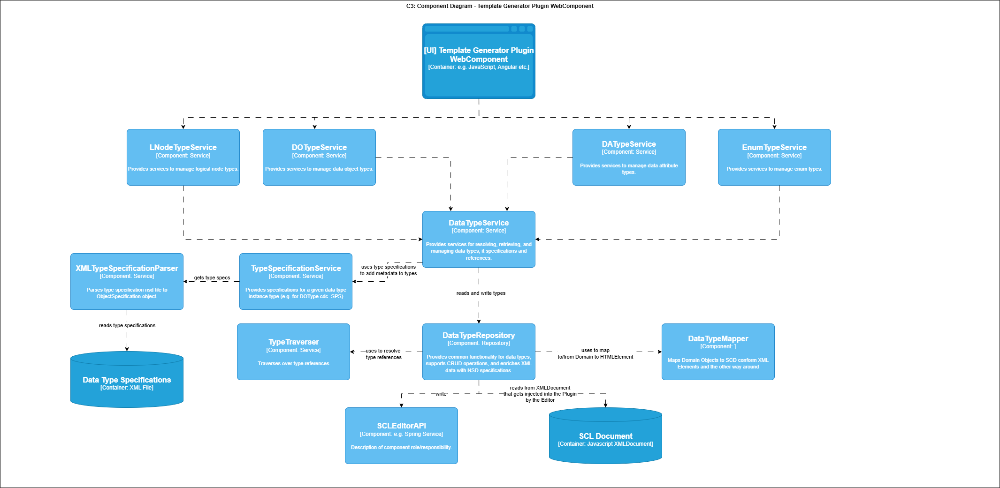

# Software Architecture (C4 Model)

## 1. Context Diagram
Shows the system in relation to users and external dependencies.

---

## 2. Container Diagram
Illustrates the main applications, services, and data stores.

---

## 3. Component Diagram
Details the internal structure of a container.

