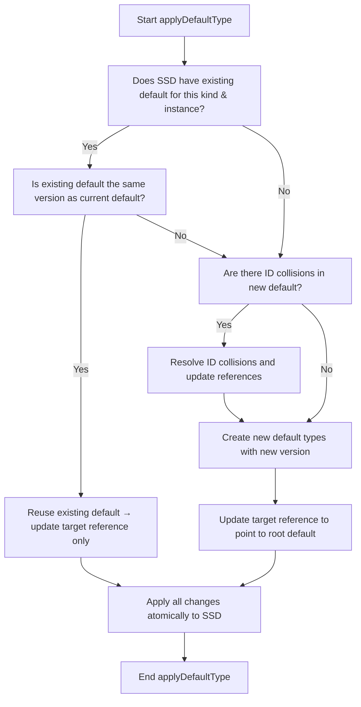

```mermaid
flowchart TD
    Start["Start applyDefaultType"]

    CheckExisting["Does SSD have existing default for this kind & instance?"]
    CompareVersion["Is existing default the same version as current default?"]
    IDCollision["Are there ID collisions in new default?"]

    ApplyExisting["Reuse existing default → update target reference only"]
    ResolveConflicts["Resolve ID collisions and update references"]
    CreateNewDefault["Create new default types with new version"]
    UpdateReference["Update target reference to point to root default"]
    ApplyChanges["Apply all changes atomically to SSD"]

    End["End applyDefaultType"]

    %% Flow connections
    Start --> CheckExisting
  CheckExisting -- Yes --> CompareVersion
    CheckExisting -- No --> IDCollision

    CompareVersion -- Yes --> ApplyExisting --> ApplyChanges
    CompareVersion -- No --> IDCollision

    IDCollision -- Yes --> ResolveConflicts --> CreateNewDefault
    IDCollision -- No --> CreateNewDefault --> UpdateReference
    UpdateReference --> ApplyChanges --> End

```
