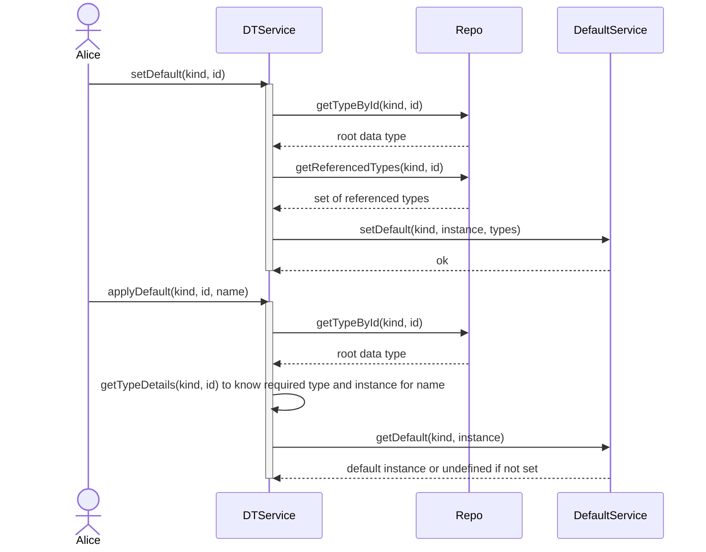

Apply Defaults Collision Detection Pseudocode 

```pseudocode
function applyDefault(kind, id, name):
    type = Repo.getTypeById(kind, id)
    if type is null:
        throw Error("Type not found")

    defaults = getTypeDefaults(kind, instnace)
    if defaults is null:
        return undefined
    
    for every default d:
       if exists type with id d.id:
          handle_id_collision(d, type)
          
    return defaultInstance[name]
```

